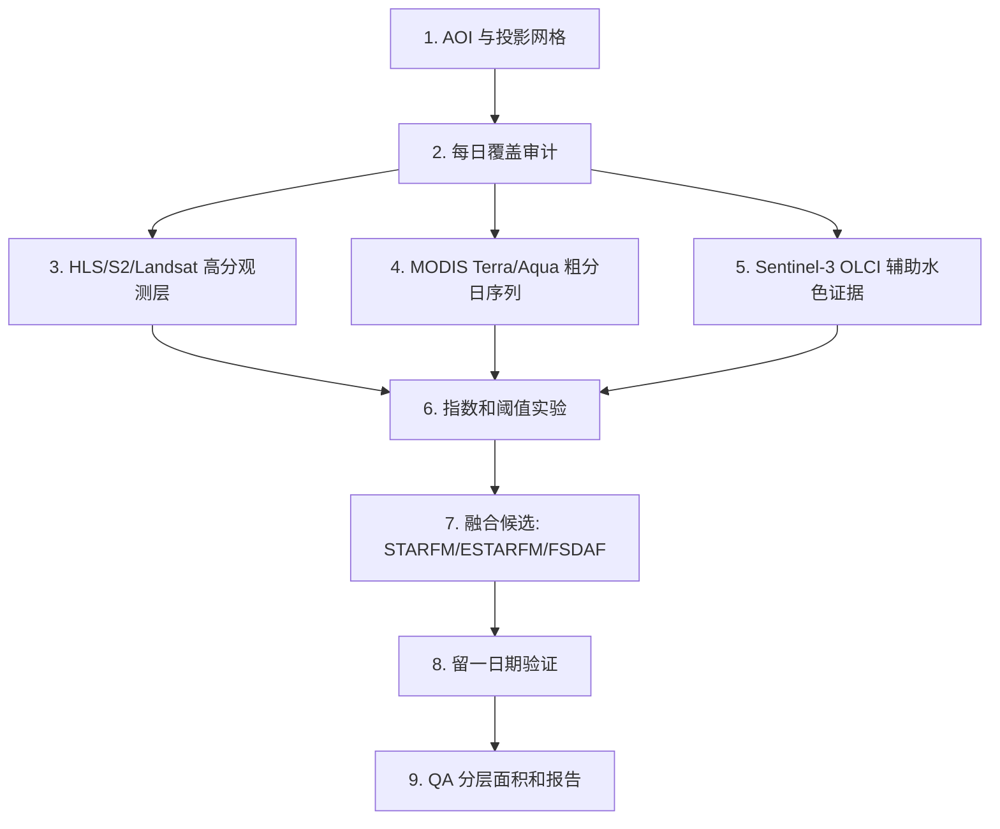

# 太湖 NDVI/FAI 蓝藻遥感流程 codex版

这个目录是对原 `taihu_ndvi_fai` 项目的独立重建版。目标不是简单复制旧流程，而是按审计后的改进路线重新组织：先做数据覆盖审计，再分传感器预处理，再计算指数和阈值，最后才讨论是否生成逐日 30 m 融合估计。

## 核心判断

旧流程已经能生成 2024-05-01 到 2024-07-31 的 92 天 NDVI/FAI/QA 产品，但主要风险是科学解释不稳：

- 高分辨率真实观测日期太少，不能把所有逐日 30 m 像元都解释成真实 30 m 观测。
- MODIS 500 m 升尺度不能产生真实 30 m 空间细节。
- 时间插值像元比例高，必须与真实观测和融合估计分开统计。
- Terra/Aqua 来源必须保留，不能再把 Aqua 写成 Terra。
- 面积统计必须使用投影坐标或逐像元面积，不能在 EPSG:4326 下固定按 30 m x 30 m 计算。

## 新流程



## 目录说明

- `configs/`: 时间范围、AOI、卫星、波段、QA 编码。
- `scripts/`: 可运行脚本骨架，按编号执行。
- `docs/`: 方法设计、执行计划、验证计划、风险自检。
- `outputs/`: 新版输出位置，按 `coverage/`、`rasters/`、`tables/` 分开。
- `reports/`: 环境检查和后续运行报告。
- `data/aoi/`: 放太湖边界、湖区分区、陆地/岸线缓冲区矢量。

## 推荐执行顺序

```powershell
cd "D:\trae work\taihu_ndvi_fai\codex版"
py -3.11 scripts\00_check_environment.py
py -3.11 scripts\01_gee_coverage_audit.py --dry-run
```

如果已经完成 Earth Engine 登录和项目配置，再去掉 `--dry-run` 运行 GEE 覆盖审计与导出脚本。

## 主要参考

- Hu, C. 2009. Floating Algae Index, Remote Sensing of Environment. https://doi.org/10.1016/j.rse.2009.05.012
- Jia et al. 2019. Taihu cyanobacteria monitoring with MODIS and GEE. https://doi.org/10.3390/rs11192269
- Gao et al. 2006. STARFM. https://doi.org/10.1109/TGRS.2006.872081
- Zhu et al. 2010. ESTARFM. https://doi.org/10.1016/j.rse.2010.05.032
- Zhu et al. 2016. FSDAF. https://doi.org/10.1016/j.rse.2015.11.016
- HLS L30/S30 GEE catalog: https://developers.google.com/earth-engine/datasets/catalog/NASA_HLS_HLSL30_v002
- Sentinel-2 Cloud Score+: https://developers.google.com/earth-engine/datasets/catalog/GOOGLE_CLOUD_SCORE_PLUS_V1_S2_HARMONIZED

